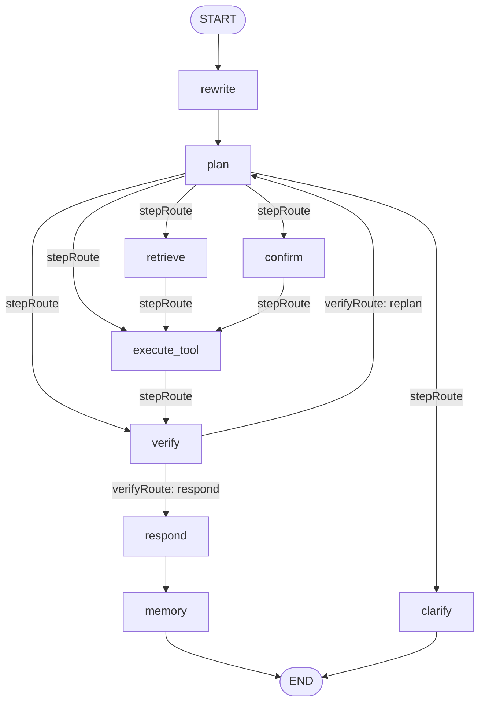

# AI 智能客服工单系统 · 技术设计文档

> 一个以 **DDD 分层 + 六边形架构** 为骨架、以 **LangGraph4j Plan-and-Execute 图** 为编排核心、
> 通过 **LangChain4j Function Calling** 驱动真实业务工具的智能客服工单系统。
> 面向"用户一句话 → AI 识别意图 → 规划并执行业务动作（含人机确认）→ 校验落库 → 生成回复"的完整闭环。

---

## 1. 项目概述

| 项 | 说明 |
|---|---|
| 定位 | AI 智能客服工单系统（面试演示项目） |
| 核心能力 | 意图识别、多步规划、业务工具自动执行、敏感操作人机确认（HITL）、结果后置校验、RAG 知识库问答、长短期记忆、AI 可观测性 |
| 架构风格 | DDD 四层 + 六边形（端口-适配器） |
| 编排引擎 | LangGraph4j（Plan-and-Execute 状态图，带中断/检查点/受控重规划） |
| AI 框架 | LangChain4j（ChatLanguageModel / Function Calling / Embedding / ChatMemory 抽象） |
| 大模型 | 通义千问 qwen-max（OpenAI 兼容协议接入） |
| 持久化 | MyBatis + MySQL（Docker） |
| 向量库 | Chroma（长期记忆语义存储）；Milvus 作为可切换实现（当前禁用） |
| 可观测性 | Langfuse（AI 调用追踪）+ `ticket_ai_record` 落库 |
| 前端 | Vue 3（`frontend/`，SSE 流式展示处理过程） |

设计主线：**AI 不直接调用 Service，而是通过领域层的"业务工具"抽象间接调用**。工具的增减不影响 AI 集成代码，
意图退化为"由所选工具反向派生的标签"，真正的驱动信号是"要执行哪个业务动作"。

---

## 2. 技术栈与版本

| 依赖 | 版本 | 用途 |
|---|---|---|
| Spring Boot | 4.1.1 | 应用框架（WebMVC + SSE + Validation） |
| Java | 17 | 语言级别（record / 文本块 / switch 表达式） |
| LangChain4j | 0.36.2 | AI 业务框架：Prompt / Tool / Memory / RAG 抽象，OpenAI 兼容模型接入 |
| LangGraph4j (core) | 1.8.19 | 多步推理工作流引擎（状态图 + 检查点 + 中断） |
| MyBatis Spring Boot Starter | 4.0.0 | 持久层 ORM |
| mysql-connector-j | (BOM) | MySQL 驱动 |
| Milvus SDK Java | 2.4.7 | 向量库客户端（当前 `ai.milvus.enabled=false`） |
| SpringDoc OpenAPI | 2.8.0 | Swagger UI 接口文档 |
| Spring Retry | 2.0.4 | AI 调用重试（`@Retryable`，需 AspectJ） |
| Lombok | (BOM) | DTO 样板代码消除 |

---

## 3. 总体架构

### 3.1 分层与依赖方向

六边形架构：外层依赖内层，**Domain 不依赖任何框架**。AI/DB/向量库都是可替换的适配器。

```
        ┌─────────────────────────────────────────────┐
        │  Interfaces 层（REST/SSE/DTO）               │   入站适配器
        │  TicketController · ConversationController   │
        └───────────────────┬─────────────────────────┘
                            │ 调用
        ┌───────────────────▼─────────────────────────┐
        │  Application 层（用例编排/事务边界）          │
        │  TicketApplicationService                    │
        │  CreateTicketCommand · TicketResult ·        │
        │  ActionConfirmResult                         │
        └───────────────────┬─────────────────────────┘
                            │ 依赖端口（接口）
        ┌───────────────────▼─────────────────────────┐
        │  Domain 层（端口 + 领域模型，纯 POJO）        │   ★ 核心
        │  端口: AiIntentRecognizer · BusinessTool ·   │
        │        KnowledgeBase · PromptManager ·       │
        │        UserMemory · ConversationMemory ·     │
        │        *Repository                           │
        │  模型: Ticket · Conversation · TicketIntent  │
        └───────────────────▲─────────────────────────┘
                            │ 实现端口（出站适配器）
        ┌───────────────────┴─────────────────────────┐
        │  Infrastructure 层（适配器实现）              │
        │  ai/ workflow/ tool/ memory/ rag/ prompt/    │
        │  persistence/ sandbox/ sse/ config/          │
        └─────────────────────────────────────────────┘
```

### 3.2 包结构

```
com.zzj.interview
├── interfaces          入站适配器：controller / dto / common(全局异常)
├── application         用例编排：service / command / result
├── domain              ★ 领域核心（端口 + 模型）
│   ├── gateway         外部网关端口
│   ├── memory          UserMemory / ConversationMemory / ConversationRepository / Conversation
│   ├── model           ticket(Ticket/TicketIntent/TicketStatus/TicketAiRecord) · conversation
│   ├── prompt          PromptManager / PromptTemplate
│   ├── rag             KnowledgeBase / KnowledgeChunk
│   ├── repository      TicketRepository
│   └── tool            BusinessTool（含 ToolParameter）/ ToolResult
└── infrastructure      出站适配器
    ├── ai              LangChain4j 模型配置 · 意图识别器 · Embedding · ChromaVectorStore
    ├── workflow        ★ LangGraph Plan-and-Execute 图 · Runner · 状态/步骤模型 · 沙箱执行器
    ├── tool            业务工具实现 + BusinessActionExecutor + LangChain4jToolAdapter
    ├── memory          Chroma/Milvus/InMemory 记忆实现 · 会话仓储 · ChatMemoryStore 桥接
    ├── rag             Milvus/InMemory 知识库实现
    ├── prompt          BuiltinPromptManager（内置版本化模板）
    ├── persistence     entity / mapper(+XML) / repository
    ├── sandbox         SafeExpressionEngine（run_code 安全沙箱）
    ├── sse             SseEvents · TicketAsyncProcessor
    └── config          Bean 配置
```

---

## 4. 核心设计：Plan-and-Execute 编排图

`LangGraphTicketWorkflow` 在构造期把状态图编译好（`CompiledGraph<TicketState>`），运行期由 `TicketGraphRunner`
驱动 `stream / getState / updateState`，并把每个 `NodeOutput` 映射成 SSE 事件推给前端。

### 4.1 图结构



| 节点 | 职责 |
|---|---|
| `rewrite` | 多轮 query 改写（指代消解/省略补全），失败则沿用原文 |
| `plan` | 调意图识别（Function Calling）→ 得到工具调用序列；注入 customerId；按"所选动作必填参数"判断是否需澄清；预置首个敏感步骤的确认文案 |
| `retrieve` | RAG 知识库检索（无工具或需知识兜底时） |
| `execute_tool` | 经 `BusinessActionExecutor` 执行单个工具（含必填参数校验、敏感门控） |
| `confirm` | **中断点**：敏感操作在此暂停，等待用户批准 |
| `verify` | 结果后置校验（不只看"调用成功"，还回查副作用是否真的落库） |
| `respond` | 基于校验后的上下文生成自然语言回复 |
| `memory` | 写入短期记忆 + 长期记忆（Chroma 向量 + 画像） |
| `clarify` | 信息不足时向用户追问（如缺订单号），本轮挂起 |

### 4.2 受控路由（条件边）

- **`stepRoute`（游标路由器）**：`plan/retrieve/execute_tool/confirm` 执行后都回到它，按"当前计划步骤游标"决定下一跳：
  - `needsClarification` → `clarify`
  - 游标耗尽（`currentStep == null`）→ `verify`
  - 检索步骤 → `retrieve`
  - 工具步骤：若 `requiresConfirmation && !approved` → `confirm`（中断）；否则 → `execute_tool`
- **`verifyRoute`**：`verified` → `respond`；`replanRequested` → `plan`（重规划）；否则 → `respond`（诚实失败也要回复）。
- **受控重规划**：`MAX_REPLAN = 1`，避免"校验失败 → 重规划 → 再失败"的无限循环；`RECURSION_LIMIT` 兜底。

> 多步计划天然支持：非敏感步骤先执行，游标走到敏感步骤时才在 `confirm` 中断。

### 4.3 人机交互确认（HITL）

采用 LangGraph4j 的 **S1 中断-恢复** 模式：

1. 编译期：`interruptBefore("confirm")` + `checkpointSaver(new MemorySaver())`，`threadId = conversationId`。
2. 运行到敏感步骤前，图在 `confirm` 前**中断**，Runner 发出 `confirmation_required` SSE 事件（携带 `actionId` 与确认文案），本轮结束。
3. 用户决策经 `POST /api/conversations/{conversationId}/actions/{actionId}` 回传 `{approved: bool}`。
4. `confirmAction` 用 `updateState(cfg, {approved: bool})` 写回检查点并**恢复**图：批准 → 进入 `execute_tool`；拒绝 → 跳过执行、走 `respond` 给出取消回复。

> ⚠️ `MemorySaver` 检查点存在 **JVM 进程内存**中。后端重启会丢失"挂起中的确认"，需重新发起该轮（详见 §8.3）。

---

## 5. 意图识别与 Function Calling

`LangChain4jIntentRecognizer`（实现 Domain 端口 `AiIntentRecognizer`）：

- 用 `chatModel.generate(messages, toolAdapter.specifications())` 发起带工具的请求；
  `AiMessage.hasToolExecutionRequests()` 为真则解析为 `ToolCall` 列表。
- **文本分支兜底**：当模型没有发起真正的 tool call、而是返回了一段文本 JSON 时，
  `parseTextResponse → synthesizeToolCalls` 会按意图与槽位**合成**等价工具调用，
  保证"取消订单/申请售后"等敏感动作不会因为模型"只说不做"而漏触发。
  - `ORDER_QUERY`：有订单号 → `query_order`；无订单号但有 customerId → `list_orders`。
  - `AFTER_SALE` → `[query_order, create_after_sale]`；`CANCEL_ORDER/LOGISTICS` 缺订单号则不合成（转澄清）。
- **意图派生**：`inferIntentFromToolCalls` 把工具名映射回意图标签（见 §6.3）。
- **槽位澄清**：订单/物流/售后/取消类意图必须有订单号；若工具参数与原文都无订单号 → 转 `clarify` 追问。
  两道护栏：① 已合成出工具（如 `list_orders` 本就无需订单号）不降级；② **通用政策咨询**（物流规则/退货政策/运费等，
  由 `isGeneralPolicyQuestion` 判定）走知识库作答，**不追问订单号**。

---

## 6. 业务工具层

### 6.1 端口与适配

- Domain 端口 `BusinessTool`：`name() / description() / parameters() / requiresConfirmation() / execute()`，
  参数用中立的 `ToolParameter`（不绑定任何 AI 框架）。
- `LangChain4jToolAdapter`：把 `BusinessTool` 适配成 LangChain4j `ToolSpecification`（生成 Function Calling JSON Schema），
  通过构造器注入 `List<BusinessTool>` **自动发现**所有 `@Component` 工具——新增工具零改动接入模型。
- `BusinessActionExecutor`：统一调度执行，含必填参数校验、敏感门控，以及 **customerId 权威注入**（见 §12）。

### 6.2 工具清单

| 工具 | 名称 | 类型 | 需确认 | 说明 |
|---|---|---|:--:|---|
| OrderQueryTool | `query_order` | 只读 | 否 | 按订单号查订单（状态/金额/时间） |
| ListOrdersTool | `list_orders` | 只读 | 否 | 按 customerId 查名下全部订单（"我有哪些订单"） |
| LogisticsQueryTool | `query_logistics` | 只读 | 否 | 查某笔订单物流 |
| QueryAfterSaleTool | `query_after_sale` | 只读 | 否 | 按订单号查售后/退款进度 |
| CancelOrderTool | `cancel_order` | 写（不可逆） | **是** | 取消订单 → `CANCELLED`，退款原路退回 |
| AfterSaleCreateTool | `create_after_sale` | 写（资金） | **是** | 发起售后 → 订单 `REFUNDING` + 写 `after_sale` 记录 |
| PayOrderTool | `pay_order` | 写（资金） | **是** | 待付款 → `PAID` |
| ProcessRefundTool | `process_refund` | 写（资金） | **是** | 退款中 → `REFUNDED`，同步 `after_sale` 记录 |
| CodeSandboxTool | `run_code` | 计算 | 否 | 安全沙箱内做精确数值计算（退款额/天数差/单位换算） |

### 6.3 工具 → 意图映射

`ActionIntentResolver`（编排层）与识别器 `inferIntentFromToolCalls` 保持一致：

| 工具 | 派生意图 |
|---|---|
| `query_order` / `list_orders` | `ORDER_QUERY` |
| `query_logistics` | `LOGISTICS` |
| `create_after_sale` / `process_refund` / `query_after_sale` | `AFTER_SALE` |
| `cancel_order` | `CANCEL_ORDER` |
| `run_code` / `pay_order` | 不决定意图（回退 AI 意图 / `UNKNOWN`） |

> `pay_order` 没有契合的 `TicketIntent`（枚举为领域既定、不轻易扩展），故不映射；意图标签仅用于落库统计/回复语气/记忆归类，不影响工具执行。

### 6.4 写操作的"真实副作用 + 后置校验"范式

所有写工具遵循同一套范式（以 `cancel_order` / `create_after_sale` / `pay_order` / `process_refund` 为例）：

1. **读真实数据**：先查订单，退款金额取订单真实 `amount`，杜绝硬编码假数据。
2. **状态守卫 + 幂等**：非法前置状态直接拒绝；已处于目标态则幂等成功（不重复写）。
3. **真实落库**：`UPDATE` 推进状态，影响行数 `<= 0` 视为失败。
4. **后置校验**：回查确认真的落到目标状态，而不是只看 `UPDATE` 返回行数——避免"谎报成功"。
5. **敏感操作** `requiresConfirmation() = true`，执行前经 HITL 确认。

---

## 7. 数据模型

### 7.1 表结构

| 表 | 用途 | 关键列 |
|---|---|---|
| `ticket` | 客服工单 | id, customer_id, content, intent, status, response |
| `ticket_ai_record` | AI 调用记录（可观测性） | ticket_id, model, prompt, response, intent, latency_ms, success |
| `order` | 订单（模拟业务数据） | id, order_no(UNIQUE), customer_id, status, amount, created_at |
| `after_sale` | 售后工单 | id, after_sale_no(UNIQUE), order_no, customer_id, type, reason, status, refund_amount, created_at, updated_at |

> MyBatis 开启 `map-underscore-to-camel-case`，实体驼峰字段自动映射下划线列。`order` 是 MySQL 保留字，SQL 中反引号包裹。

### 7.2 订单状态机（`OrderStatus`）

```
CREATED(待付款) ──pay_order──▶ PAID(已支付) ──发货──▶ SHIPPED(已发货) ──签收──▶ DELIVERED(已签收)
     │                              │                      │                       │
     │ cancel_order                 │ create_after_sale    │ create_after_sale     │ create_after_sale
     ▼                              ▼                      ▼                       ▼
CANCELLED(已取消)            REFUNDING(退款中) ──process_refund──▶ REFUNDED(已退款)
```

- 取消：`cancel_order` 把订单置 `CANCELLED`（退款随取消流程）。**状态守卫**：仅 `CREATED/PAID/SHIPPED` 可取消；
  `DELIVERED`（已签收）需走售后退款、`REFUNDING/REFUNDED` 不可取消；`CANCELLED` 幂等成功。
- 售后：`create_after_sale` 把订单置 `REFUNDING` 并写一条 `after_sale`（单号 `AS+orderNo`，状态 `REFUNDING`）。
- 到账：`process_refund` 把订单与 `after_sale` 记录同步置 `REFUNDED`。
- `status` 列为 `VARCHAR(32)`，新增枚举值无需改表结构；`OrderStatus.labelOf(code)` 把状态码翻译成中文标签（未知码原样返回）。

### 7.3 数据库初始化机制（重要运维约定）

- `compose.yaml` 仅把 `schema.sql` 挂到 `/docker-entrypoint-initdb.d/`，**只在数据卷全新时执行一次**；`data.sql` 未挂载。
- 应用未配置 `spring.sql.init`，对 MySQL **不会自动跑** `schema.sql/data.sql`。
- MySQL 数据卷 `mysql_data` **跨重启持久化**。
- 因此：**改表结构或种子数据后，必须用 `docker exec` 手动迁移实时库**（建表用 `IF NOT EXISTS`、插入用 `WHERE NOT EXISTS` 保证幂等，客户端加 `--default-character-set=utf8mb4` 防中文乱码）。

---

## 8. 记忆系统

### 8.1 短期记忆（多轮上下文）

- `InMemoryConversationMemory`：按会话保存消息窗口（`ConcurrentHashMap`）。
- `InMemoryConversationRepository`：`Conversation` 聚合的内存仓储（多轮骨干）。
- `ConversationMemoryChatMemoryStore`：把上述短期记忆桥接成 LangChain4j 的 `ChatMemoryStore`。

### 8.2 长期记忆（跨会话语义召回）

`ChromaVectorUserMemory`（`@Primary`，`ai.chroma.enabled=true` 时生效）：

- **历史交互的语义向量 → Chroma**：一次交互 → 大模型压缩为要点摘要 → embedding 向量化 → upsert 进 Chroma（cosine）；
  检索时查询向量化 → 按 `user_id` 过滤做语义 Top-K。
- **用户画像 profile（偏好/交互次数/最近摘要）→ `InMemoryUserMemory`**（内存，读取快）。
- Chroma 不可用时自动降级为纯内存画像（`upsert/query` 返回空/false，不抛异常）。
- `MilvusVectorUserMemory` 为可切换实现（当前 `ai.milvus.enabled=false`，未启用）。

### 8.3 重启后的记忆边界（易混淆点）

| 记忆 | 存储位置 | 后端重启后 |
|---|---|---|
| 长期语义记忆（交互向量） | **Chroma 容器 + 持久卷 `chroma_data`** | **保留**（除非 `docker compose down -v` 删卷） |
| 用户画像 profile | JVM 内存（`InMemoryUserMemory`） | 丢失 |
| 短期/多轮上下文 | JVM 内存（`InMemoryConversationMemory/Repository`） | 丢失 |
| LangGraph 检查点（挂起中的 HITL 确认） | JVM 内存（`MemorySaver`） | 丢失，需重新发起该轮 |

---

## 9. RAG 知识库

- `MilvusVectorKnowledgeBase`（`@Primary`）：Milvus 启用时走向量检索，启动时从 `InMemoryKnowledgeBase` 迁移种子。
- 当前 `ai.milvus.enabled=false` → 降级为 `InMemoryKnowledgeBase`（关键词/TF-IDF 式匹配），内置 7 条 FAQ：
  物流时效、退换货政策、支付方式、售后流程、订单说明、发票、会员权益。
- **通用政策咨询**（"你们平台的物流规则是什么"）由识别器归为 `UNKNOWN` 并走知识库作答，不追问订单号、不调用需订单号的工具。

---

## 10. Prompt 工程化

`BuiltinPromptManager`（实现 `PromptManager`）内置**版本化**模板，`@PostConstruct` 注册到 `ConcurrentHashMap`：

| 模板 | 版本 | 用途 |
|---|---|---|
| `intent_recognition` | 1.2.0 | 意图识别 + Function Calling 工具选择（含通用政策走知识库的规则） |
| `query_rewrite` | 1.0.0 | 多轮 query 改写（指代消解/省略补全） |
| `response_generation` | 1.0.0 | 回复生成 |
| `rag_enhanced` | 1.0.0 | 结合知识库的增强回复 |
| `memory_summary` | 1.0.0 | 对话要点摘要（供长期记忆压缩） |

> 模板内容变更时递增版本号，便于 A/B 与迭代追溯。

---

## 11. API 接口

| 方法 | 路径 | 说明 |
|---|---|---|
| POST | `/api/tickets/stream` | 创建工单并以 **SSE** 流式推送处理过程（请求体 `{customerId, content, conversationId?}`；首轮可不传 conversationId，由后端生成并在事件中回传） |
| POST | `/api/conversations/{conversationId}/actions/{actionId}` | **HITL 确认**：回传 `{approved: bool}` 批准/拒绝挂起的敏感操作 |
| GET | `/api/tickets/health` | 健康检查 |

SSE 事件由 `SseEvents` 定义、`TicketAsyncProcessor` / `TicketGraphRunner` 把图节点输出映射为事件（分析进度、工具执行、`confirmation_required`、最终回复等）。
会话状态冲突（如没有待确认操作）在 `ConversationController` 内转为 `409 INVALID_CONVERSATION_STATE`，不污染全局异常语义。
Swagger UI 由 SpringDoc 提供。

---

## 12. 安全设计

- **customerId 权威注入**：`TicketController` 在 `@Valid` 之后把 `customerId` 强制改写为服务端上下文值（演示中为 `C001`）；
  编排层 `BusinessActionExecutor.injectCustomerId(toolName, args, customerId)` 在工具声明了 `customerId` 参数时
  **覆盖模型给出的任何值**——防止模型被诱导跨客户读写数据。请求体仍需带非空 `customerId` 以通过校验，但服务端不信任其值。
- **敏感操作门控**：资金/不可逆动作（取消、售后、支付、退款到账）`requiresConfirmation=true`，必经 HITL 确认才执行。
- **代码沙箱**：`run_code` 在 `SafeExpressionEngine` 受限沙箱内执行，仅做数值计算，不触碰任意代码执行。
- **密钥管理**：模型/可观测性密钥经环境变量注入（`AI_QWEN_API_KEY`、`AI_LANGFUSE_*` 等），文档与日志中不出现明文值。

---

## 13. 可观测性（LLMOps）

- **Langfuse**：`AI_LANGFUSE_ENABLED=true` 时接入，追踪 AI 调用（compose 中预置默认组织/项目/API Key，首启免手动建）。
- **`ticket_ai_record` 落库**：每次 AI 调用记录 model/prompt/response/intent/latency/success，体现"AI 不是黑盒，需要可追溯"。

---

## 14. 部署

`compose.yaml` 服务：

| 服务 | 镜像 | 端口 | 说明 |
|---|---|---|---|
| `mysql` | mysql:latest | 3306 | 业务库（挂载 `schema.sql` 到 initdb.d；持久卷 `mysql_data`） |
| `chroma` | chromadb/chroma | 8000 | 长期记忆向量库（`IS_PERSISTENT=TRUE`，持久卷 `chroma_data`） |
| `langfuse` + `langfuse-db` | langfuse:2 / postgres:16 | 3000 / 5432 | AI 可观测性平台及其库 |
| `backend` | 本地构建（Dockerfile） | 8080 | Spring Boot 应用，依赖 mysql/chroma 健康后启动 |
| `milvus`（注释） | milvusdb/milvus | 19530 | 可选向量库，当前禁用 |

后端关键环境变量：数据源、`AI_QWEN_*`、`AI_LANGFUSE_*`、`AI_MILVUS_ENABLED=false`、`AI_CHROMA_ENABLED=true`、`AI_EMBEDDING_MOCK_ENABLED=false`。

---

## 15. 测试

- 全量 **121 个单元测试，0 失败**（`./mvnw -o test`，离线）。
- 覆盖：工单聚合、识别器（文本兜底/工具合成/政策问题判定/记忆窗口）、Plan-and-Execute 图路由、
  中断-恢复 PoC、各业务工具（取消/售后/支付/退款到账/售后查询的守卫+幂等+后置校验）、
  `BusinessActionExecutor`（必填参数/customerId 注入）、`ActionIntentResolver`、沙箱执行器、内存知识库等。
- 工具类测试统一用 Mockito 打桩 Mapper，无需真实数据库。

构建约定（本机）：`mvn` 不在 PATH，用 `./mvnw` 离线构建，`JAVA_HOME` 指向本机 JDK17。

---

## 16. 关键设计决策与权衡

| 决策 | 动机 / 权衡 |
|---|---|
| 意图退化为"派生标签"，以"业务动作"为驱动 | 假设 AI 团队已提供意图能力，业务系统真正关心"执行哪个动作"；意图仅用于统计/语气/记忆归类 |
| Plan-and-Execute 图 + 游标路由 | 多步计划可控、可中断、可重规划；比"一把梭"链式调用更易测试与观测 |
| 受控重规划（MAX_REPLAN=1） | 校验失败可自愈一次，又避免无限循环 |
| 工具后置校验（回查而非只看影响行数） | 杜绝"谎报成功"，保证回复与真实库状态一致 |
| 文本分支合成工具调用 | 兼容模型"只说不做"（返回文本 JSON 而非 tool call），敏感动作不漏触发 |
| customerId 服务端权威注入 | 安全红线：不信任模型输出的归属字段，防越权 |
| 长期记忆向量入 Chroma、画像留内存 | 语义召回需持久化与跨会话；画像读多写少、内存更快，重启丢失可接受 |
| DB 脚本不自动跑、手动迁移实时库 | 数据卷持久化下，initdb.d 只首启生效；显式迁移避免"以为改了其实没生效" |

---

## 17. 已知限制与可演进方向

- **短期记忆/画像/检查点为进程内存**：后端重启即丢；生产可替换为 Redis（短期）+ 持久化 Checkpoint（如 Postgres/Redis Saver）。
- **知识库当前为内存关键词匹配**：启用 Milvus 即切换为向量语义检索（代码已就绪，配置开关切换）。
- **`pay_order` 无专属意图标签**：受限于既定 `TicketIntent` 枚举；如需精细化统计可评估扩展枚举。
- **演示态 customerId 固定 C001**：接入真实鉴权后应来自登录态/Token。
- **B 阶段新工具（pay_order/process_refund/query_after_sale）的端到端验证**：需在加载了新构建的后端上跑通
  支付/售后查询/退款到账三条链路（单元测试已覆盖工具逻辑与守卫）。

---

*本文档描述系统的设计与实现现状；如与代码不一致，以代码为准。*
